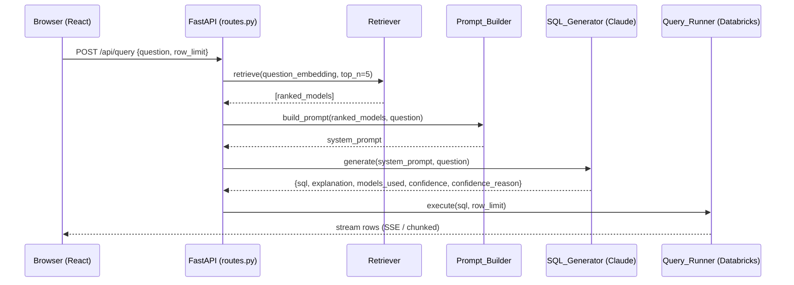
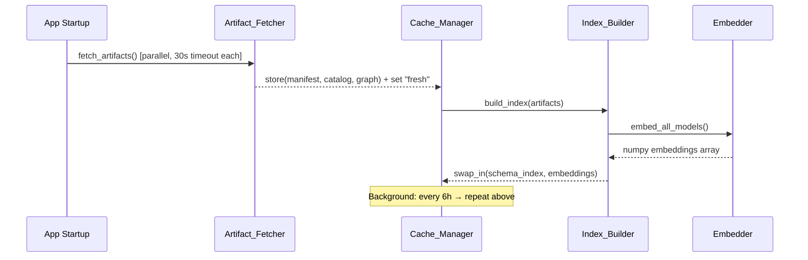
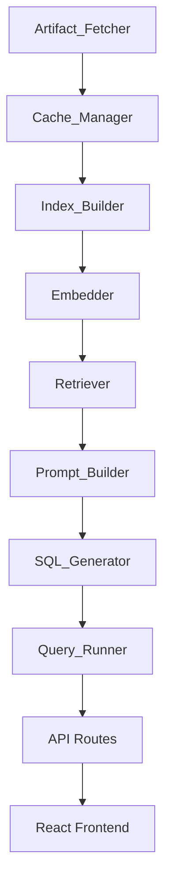

# Design Document — Prism

## Overview

Prism is a natural language analytics assistant deployed as a Databricks App. It lets business users ask plain-English questions about their data and receive real SQL-backed answers without writing any SQL or manually configuring schemas.

On startup, Prism fetches three dbt CI artifacts (manifest.json, catalog.json, graph_summary.json) from a GitLab project, parses them into an in-memory semantic index, and computes sentence-transformer embeddings for every model. When a user submits a question, Prism embeds the question, retrieves the most relevant models by cosine similarity, builds a Claude prompt with full schema context, generates SQL, executes it against a Databricks SQL warehouse with workspace OAuth, and streams results back to a React frontend.

The full stack is:

| Layer | Technology |
|---|---|
| Backend API | Python 3.11 + FastAPI + uvicorn |
| LLM | Anthropic Claude API (`claude-sonnet-4-6`) |
| Embeddings | `sentence-transformers` `all-MiniLM-L6-v2` + numpy |
| SQL execution | `databricks-sql-connector` (workspace OAuth) |
| Artifact fetch | `httpx` async |
| Frontend | React (TypeScript) + Vite |
| Deployment | Databricks Apps via `app.yaml`; Docker image via multi-stage `Dockerfile` |
| Local dev config | `python-dotenv` — auto-loads `.env` locally, no-op in production |

There are **no external databases, no Redis, and no vector stores** — all state lives in-process memory for the lifetime of the application process.

---

## Architecture

### High-Level Request Flow



### Startup and Background Flow



### Component Dependency Map



### Deployment Architecture

Prism runs as a single process. The FastAPI application serves both the REST API (under `/api/`) and the compiled React static files (under `/`). There is no separate web server or proxy layer — uvicorn handles everything.

```
Databricks Apps runtime            (production)
  └─ uvicorn backend.main:app --host 0.0.0.0 --port 8000
       ├─ /api/*   → FastAPI routes  (Python)
       └─ /*       → React SPA       (static files from frontend/dist/)

Docker container                   (local dev / evaluation)
  └─ same uvicorn command, same process
       ├─ credentials from .env file via python-dotenv
       └─ no Databricks secret scope required for local testing
```

**Distribution model:** Other companies deploy Prism directly from the public GitHub repository URL — no forking or private copy needed. The deploying organisation creates a `prism-secrets` Databricks secret scope, adds three secrets, sets four non-secret env vars in the App UI, and clicks Deploy. The secret scope name `prism-secrets` is a hard convention that all deployments must follow.

---

## Components and Interfaces

### 1. `discovery/gitlab_fetcher.py` — Artifact_Fetcher

Responsible for downloading the three dbt artifacts from GitLab CI.

```python
class ArtifactFetcher:
    async def fetch_all(self) -> ArtifactBundle | FetchError
    async def _fetch_one(self, filename: str, client: httpx.AsyncClient) -> bytes | FetchError
```

- Uses `httpx.AsyncClient` with `asyncio.gather` to fetch all three files concurrently.
- Per-request timeout: 30 seconds.
- Auth header: `PRIVATE-TOKEN: {GITLAB_TOKEN}` (retrieved from Databricks secret scope via `dbutils.secrets`).
- URL pattern: `{GITLAB_BASE_URL}/projects/{GITLAB_PROJECT_ID}/jobs/artifacts/main/raw/public/{filename}?job=pages`
- On HTTP 401/403 or missing token: logs masked token info, sets cache status `"unavailable"`, does **not** raise.
- On partial failure (1-2 files fail): logs per-file failures, preserves last good cache for failed files, sets status `"stale"`.

### 2. `discovery/manifest_parser.py` — ManifestParser

Parses `manifest.json` and extracts per-model metadata.

```python
class ManifestParser:
    def parse(self, raw: bytes) -> list[ModelMeta]
```

- Extracts: `name`, `database`, `schema`, `fqn`, columns (name + description), `meta.grain`, `compiled_sql[:500]`, `depends_on.nodes`, `tags`, `fqn` path.
- Missing/null fields → zero value (empty string / empty list / 0) + WARN log.
- Top-level JSON parse error → raises `ParseError`; caller (Index_Builder) handles it.

### 3. `discovery/catalog_parser.py` — CatalogParser

Merges `catalog.json` data (actual column types, row counts) into model metadata.

```python
class CatalogParser:
    def merge(self, models: list[ModelMeta], raw: bytes) -> list[ModelMeta]
```

- For each model present in both manifest and catalog: overrides column types with catalog-sourced types, sets `row_count` from catalog stats.
- For models absent from catalog: retains manifest-declared types, sets `row_count = 0`.
- Column names are **never** normalised or case-transformed (Requirement 15.1).

### 4. `discovery/graph_parser.py` — GraphParser

Parses `graph_summary.json` to build the lineage adjacency list.

```python
class GraphParser:
    def parse(self, raw: bytes) -> dict[str, LineageNode]
```

Returns a dict: `model_name → {parents: [...], children: [...]}`.

### 5. `discovery/index_builder.py` — Index_Builder

Orchestrates parsing, merging, layer inference, grain inference, and embedding generation.

```python
class IndexBuilder:
    def build(self, bundle: ArtifactBundle) -> SchemaIndex
```

**Layer inference** (priority order per Requirement 3.3):
1. Tag contains `gold` / `silver` / `bronze` (case-insensitive).
2. Folder path segment contains one of those words.
3. Default → `bronze`.

**Grain inference** when `meta.grain` is absent (Requirement 3.6):
1. Scan `compiled_sql[:500]` for GROUP BY column list.
2. Detect DISTINCT keyword.
3. Check model name for `_by_{dimension}` suffix pattern.
4. If none match → `"unknown"`.

On total parse failure of any artifact file: logs file name + error, preserves previous `SchemaIndex`, returns without swapping. If no prior index exists, sets cache status `"unavailable"`.

### 6. `discovery/cache_manager.py` — Cache_Manager

Thread-safe in-memory store for artifacts and the active `SchemaIndex`.

```python
class CacheManager:
    def get_index(self) -> SchemaIndex | None
    def get_status(self) -> CacheStatus   # "fresh" | "stale" | "unavailable"
    def get_meta(self) -> CacheMeta       # last_refresh_utc, model_count
    async def refresh(self) -> RefreshResult
    def swap_index(self, new_index: SchemaIndex) -> None  # atomic
```

- Uses `asyncio.Lock` for atomic swap.
- Background task: `asyncio.create_task` on a 6-hour loop; on failure, retries every 5 minutes indefinitely.
- While refresh runs, all reads serve the previous (good) index.
- Exposes status / meta to the `/api/status` endpoint consumed by the frontend.

### 7. `search/embedder.py` — Embedder

Loads `all-MiniLM-L6-v2` once at startup; generates embeddings on demand.

```python
class Embedder:
    def load(self) -> None                             # called once at startup
    def embed_models(self, models: list[ModelMeta]) -> np.ndarray   # shape (N, 384)
    def embed_question(self, question: str) -> np.ndarray           # shape (384,)
```

Text representation per model (Requirement 4.1):
```
"{model_name}: {description}. Columns: {col1} ({type1}) {desc1}, {col2} ..."
```

### 8. `search/retriever.py` — Retriever

Computes cosine similarity and applies Gold/Silver score boosts.

```python
class Retriever:
    def retrieve(self, question_vec: np.ndarray, top_n: int = 5) -> list[RankedModel]
```

- Cosine similarity: `(embeddings @ question_vec) / (||embeddings|| * ||question_vec||)` via numpy.
- Boosts: Gold +0.05, Silver +0.025 added to raw cosine score before ranking.
- Always returns top-N even if all scores < 0.1; sets `confidence_hint="low"` in that case.
- Must complete within 2 seconds for ≤500 models (pure numpy; in practice < 50ms).

### 9. `generation/prompt_builder.py` — Prompt_Builder

Assembles the Claude system prompt from retrieved model schemas.

```python
class PromptBuilder:
    def build(self, models: list[RankedModel], question: str) -> str
```

System prompt sections (Requirement 5.1, 5.2):
1. **Schema block** per model: fully qualified name, all columns (≤300) with types and descriptions, grain, layer, compiled SQL excerpt.
2. **Lineage block**: direct parent/child relationships from the adjacency list.
3. **Dialect rules**: fully qualified `catalog.schema.table` names; backtick-quoted columns with special chars; `DATE_TRUNC` / `DATEADD` / `DATEDIFF`; `QUALIFY` for window filtering; default `LIMIT 1000`; no `SELECT *`.
4. **Deduplication instruction**: injected when grain is `"unknown"` or no GROUP BY / DISTINCT / `_by_` pattern (Requirement 5.3).

If a model has >300 columns, includes the first 300 and logs a WARNING (Requirement 15.3).

### 10. `generation/sql_generator.py` — SQL_Generator

Calls the Claude API and validates the structured JSON response.

```python
class SQLGenerator:
    async def generate(self, system_prompt: str, question: str) -> SQLResult | GenerationError
```

- Model: `claude-sonnet-4-6`, `max_tokens=2000`.
- Required JSON fields: `sql`, `explanation`, `models_used`, `confidence`, `confidence_reason`.
- On non-200, timeout (30s), or invalid JSON: returns `GenerationError` with user-facing message "Unable to generate SQL — please try rephrasing your question."
- Logs: question[:500], selected model names, Claude model ID, token count, outcome.
- Post-generation: extracts column references from SQL, cross-checks against Schema_Index; unrecognised columns → WARN log + sets `confidence="low"` (Requirement 15.4, 15.5).

### 11. `execution/databricks_runner.py` — Query_Runner

Executes SQL against the Databricks SQL warehouse.

```python
class QueryRunner:
    async def execute(self, sql: str, row_limit: int = 1000) -> AsyncIterator[ResultRow]
```

- Uses `databricks-sql-connector` with workspace OAuth token (`ServerlessComputeClient` / `oauth_type="azure-msp"` or equivalent runtime injection).
- Streams rows as they arrive (cursor iteration).
- Enforces `row_limit` (1–10000); injects `LIMIT {row_limit}` if not already present.
- DDL/DML guard: checks SQL for prohibited keywords (CREATE, INSERT, UPDATE, DELETE, DROP, ALTER, TRUNCATE, MERGE, REPLACE) before execution; raises `SecurityError` if detected (Requirement 11.5).
- Auto-retry on warehouse error: calls `SQLGenerator.generate(question, failed_sql, error_msg)` once; if that also fails, surfaces the safe error + failed SQL (Requirement 6.6, 6.7, 6.8).
- Falls back to workspace default warehouse if `DATABRICKS_SQL_WAREHOUSE` is invalid (Requirement 14.4).

### 12. `api/routes.py` — API Routes

FastAPI router defining all HTTP endpoints.

| Method | Path | Description |
|---|---|---|
| `POST` | `/api/query` | Submit a natural language question |
| `GET` | `/api/status` | Cache status, model count, last refresh |
| `POST` | `/api/refresh` | Admin: trigger manual refresh |
| `POST` | `/api/auth` | Admin: validate password |
| `GET` | `/api/schema` | Full model list for Schema_Explorer |
| `GET` | `/api/schema/{model}` | Detail panel data for one model |

All endpoints include correlation ID injection via FastAPI middleware. Error responses follow a consistent `{"error": "...", "correlation_id": "..."}` shape.

### 13. `api/models.py` — Pydantic Models

Key request/response contracts:

```python
class QueryRequest(BaseModel):
    question: str
    row_limit: int = Field(default=1000, ge=1, le=10000)
    correlation_id: str | None = None

class SQLResult(BaseModel):
    sql: str
    explanation: str
    models_used: list[str]
    confidence: Literal["high", "medium", "low"]
    confidence_reason: str

class QueryResponse(BaseModel):
    sql_result: SQLResult
    rows: list[dict]
    row_count: int
    execution_time_ms: int
    warehouse_name: str
    correlation_id: str

class StatusResponse(BaseModel):
    cache_status: Literal["fresh", "stale", "unavailable"]
    last_refresh_utc: datetime | None
    model_count: int

class RefreshResponse(BaseModel):
    success: bool
    model_count: int | None
    error: str | None
```

### 14. Frontend Components

All React components live under `frontend/src/`.

| Component | Role |
|---|---|
| `SearchBar` | Main question input + submit; chip example questions |
| `ResultsTable` | Sortable table; Download CSV; streaming row display |
| `SQLViewer` | Syntax-highlighted SQL; copy-to-clipboard |
| `ExplanationPanel` | Collapsible "How I answered this"; models_used tags |
| `SchemaExplorer` | Sidebar; Gold/Silver/Bronze sections; search; detail panel |
| `ConfidenceIndicator` | Green / Amber / Red badge |
| `SchemaHealthBar` | Landing page status: model count, last refresh, stale/unavailable warning |
| `Pages/Home` | Landing page layout |
| `Pages/Results` | Results page layout |
| `Pages/Settings` | Admin settings (password gated) |

Frontend communicates with the backend exclusively through the `/api/*` REST endpoints using `fetch` / `EventSource` for streaming rows.

---

## Data Models

### `ModelMeta` — per-model schema metadata

```python
@dataclass
class ColumnMeta:
    name: str
    data_type: str       # from catalog.json (or manifest.json if catalog absent)
    description: str     # from manifest.json

@dataclass
class ModelMeta:
    name: str
    database: str
    schema_name: str
    fqn: str             # catalog.schema.table
    columns: list[ColumnMeta]
    grain: str           # "unknown" if not determinable
    layer: Literal["bronze", "silver", "gold"]
    compiled_sql_excerpt: str   # first 500 chars
    depends_on: list[str]       # direct parent model names
    tags: list[str]
    folder_path: str
    row_count: int              # 0 if absent from catalog.json
    last_updated: datetime | None  # from catalog run stats
    description: str            # model-level description from manifest
```

### `SchemaIndex` — top-level in-memory index

```python
@dataclass
class SchemaIndex:
    models: list[ModelMeta]                  # ordered list, index == row in embeddings
    embeddings: np.ndarray                   # shape (N, 384), float32
    lineage: dict[str, LineageNode]          # model_name → {parents, children}
    built_at: datetime
    model_count: int
```

### `LineageNode`

```python
@dataclass
class LineageNode:
    parents: list[str]
    children: list[str]
```

### `ArtifactBundle`

```python
@dataclass
class ArtifactBundle:
    manifest: bytes
    catalog: bytes
    graph: bytes
    fetched_at: datetime
```

### `CacheState` (in-memory, managed by CacheManager)

```python
@dataclass
class CacheState:
    bundle: ArtifactBundle | None
    index: SchemaIndex | None
    status: Literal["fresh", "stale", "unavailable"]
    last_refresh_utc: datetime | None
    refresh_lock: asyncio.Lock
```

### `RankedModel`

```python
@dataclass
class RankedModel:
    model: ModelMeta
    raw_similarity: float
    adjusted_score: float    # raw + layer boost
    confidence_hint: Literal["high", "medium", "low"] | None
```

### `SQLResult` (mirrors the Pydantic API model above)

```python
@dataclass
class SQLResult:
    sql: str
    explanation: str
    models_used: list[str]
    confidence: Literal["high", "medium", "low"]
    confidence_reason: str
```

### Configuration (from environment variables)

```python
@dataclass
class AppConfig:
    gitlab_base_url: str
    gitlab_project_id: str
    gitlab_token: str                    # from Databricks secret scope
    databricks_sql_warehouse: str
    anthropic_api_key: str               # from Databricks secret scope
    admin_password_hash: str             # bcrypt hash, from Databricks secret scope

    # Optional: explicit server hostname for databricks-sql-connector.
    # Empty string = connector infers from DATABRICKS_HOST (set automatically in Apps).
    # Useful in Docker/local environments where DATABRICKS_HOST is not set.
    databricks_server_hostname: str = ""

    default_row_limit: int = 1000
    refresh_interval_hours: int = 6
    retry_interval_minutes: int = 5
```

`AppConfig.from_env()` calls `python-dotenv`'s `load_dotenv()` as its first action. When running locally (Docker or plain Python), this loads variables from a `.env` file automatically. In Databricks Apps production, no `.env` file exists and `load_dotenv()` is a silent no-op — secrets have already been injected by the runtime from the `prism-secrets` secret scope.

---

## Correctness Properties

*A property is a characteristic or behavior that should hold true across all valid executions of a system — essentially, a formal statement about what the system should do. Properties serve as the bridge between human-readable specifications and machine-verifiable correctness guarantees.*

---

### Property 1: Artifact URL Construction

*For any* GitLab base URL, project ID, and artifact filename, the Artifact_Fetcher SHALL always produce a URL that exactly matches the pattern `{base_url}/projects/{project_id}/jobs/artifacts/main/raw/public/{filename}?job=pages` with no deviation.

**Validates: Requirements 1.2**

---

### Property 2: Cache Status Response Completeness

*For any* internal CacheState (regardless of whether the index is fresh, stale, or unavailable), the `/api/status` response SHALL always contain all three fields: `cache_status`, `last_refresh_utc`, and `model_count`, with appropriate zero values when no index exists.

**Validates: Requirements 2.7**

---

### Property 3: Layer Inference Priority Order

*For any* model entry with any combination of tags and folder path, the inferred layer SHALL always follow the priority order: tag match → folder path match → default "bronze". Specifically, if a gold/silver/bronze tag is present, it always wins over folder path, regardless of what the folder path contains; and if neither tag nor folder path matches, the result is always "bronze".

**Validates: Requirements 3.3**

---

### Property 4: Schema Merge Fidelity

*For any* model present in both manifest.json and catalog.json, the merged Schema_Index entry SHALL always have column types sourced from catalog.json and column descriptions sourced from manifest.json. *For any* model present in manifest.json but absent from catalog.json, the row_count SHALL always be 0 and declared column types from manifest.json SHALL be used.

**Validates: Requirements 3.4, 15.2**

---

### Property 5: Missing Field Zero-Value Handling

*For any* model entry in manifest.json that has any combination of missing or null fields, the Index_Builder SHALL always record those fields as their zero value (empty string for strings, empty list for lists, 0 for integers) and SHALL always continue building the index for that model and all subsequent models — it SHALL never skip a model or halt construction due to a missing individual field.

**Validates: Requirements 3.7**

---

### Property 6: Column Name Preservation (Round-Trip Fidelity)

*For any* manifest.json and catalog.json content, every column name that appears in those source files SHALL appear in the Schema_Index with the exact same string — no case transformation, whitespace normalisation, or renaming applied. The set of column names in the index SHALL be identical to the set in the sources.

**Validates: Requirements 3.2, 15.1**

---

### Property 7: Model Text Representation Completeness

*For any* ModelMeta object, the text representation produced by the Embedder SHALL always contain the model's name and every column name. No column name from the ModelMeta SHALL be absent from the generated text string.

**Validates: Requirements 4.1**

---

### Property 8: Retrieval Ranking by Adjusted Score

*For any* non-empty embeddings matrix and any question vector, the Retriever SHALL return a list of at most min(5, N) models ordered by adjusted_score descending, where no model ranked at position i has a lower adjusted_score than any model at position i+1.

**Validates: Requirements 4.4**

---

### Property 9: Layer Score Boost Computation

*For any* model with a known layer and raw cosine similarity score, the adjusted_score SHALL always equal: raw_score + 0.05 for Gold models, raw_score + 0.025 for Silver models, raw_score + 0.0 for Bronze models. No other boost values are valid.

**Validates: Requirements 4.5**

---

### Property 10: Prompt Schema Content Completeness

*For any* list of retrieved RankedModels, the system prompt produced by the Prompt_Builder SHALL always contain: the fully qualified name (`catalog.schema.table`) of every retrieved model; every column name for each model (up to 300); and all Databricks SQL dialect keywords (`DATE_TRUNC`, `DATEADD`, `DATEDIFF`, `QUALIFY`, `LIMIT`).

**Validates: Requirements 5.1, 5.2**

---

### Property 11: Deduplication Instruction Injection

*For any* model that satisfies **either** of the following conditions, the system prompt produced by the Prompt_Builder SHALL always contain an explicit deduplication instruction directing Claude to add DISTINCT or ROW_NUMBER() logic for that model:
- the model's `grain` field is `"unknown"`, OR
- the model's `compiled_sql_excerpt` contains no GROUP BY clause, no DISTINCT keyword, AND the model name has no `_by_{dimension}` suffix.

A model that meets neither condition SHALL NOT receive the deduplication instruction.

**Validates: Requirements 5.3**

---

### Property 12: Claude Response Validation

*For any* Claude API response string, the SQL_Generator's validation function SHALL return a GenerationError for every response that is missing any of the five required fields (`sql`, `explanation`, `models_used`, `confidence`, `confidence_reason`) or where any field has an incorrect type, and SHALL return a valid SQLResult only when all five fields are present with the correct types.

**Validates: Requirements 5.5**

---

### Property 13: Row Limit Enforcement

*For any* SQL string and any row_limit value in [1, 10000], the Query_Runner SHALL always inject or enforce a LIMIT clause such that the effective limit applied to the query is exactly the requested row_limit, and no more than 10000 rows can ever be returned regardless of the row_limit value supplied.

**Validates: Requirements 6.4**

---

### Property 14: CSV Export Correctness

*For any* non-empty list of result rows, the generated CSV file SHALL always have column header names in the first row, contain every result row (no rows dropped), be UTF-8 encoded, and have a filename matching the pattern `prism_results_{timestamp}.csv`.

**Validates: Requirements 7.2**

---

### Property 15: Confidence Indicator Display Mapping

*For any* confidence value from the set {`"high"`, `"medium"`, `"low"`}, the ConfidenceIndicator component SHALL always render the label "High" (green), "Medium" (amber), or "Low" (red) respectively — no other label or color combination is valid.

**Validates: Requirements 7.4**

---

### Property 16: Schema Health Indicator Display Mapping

*For any* CacheStatus value from the set {`"fresh"`, `"stale"`, `"unavailable"`}, the SchemaHealthBar component SHALL always display the correct text: model count + elapsed time for "fresh"; model count + warning label for "stale"; and "Schema unavailable — contact your data team" for "unavailable".

**Validates: Requirements 8.3**

---

### Property 17: Schema_Explorer Model Grouping

*For any* list of ModelMeta objects with any combination of layers, every model SHALL appear in exactly the layer section that matches its `layer` field — no model appears in the wrong section, no model is duplicated across sections, and no model is omitted from its correct section.

**Validates: Requirements 9.2**

---

### Property 18: Schema_Explorer Search Filtering

*For any* search query string and any list of models, the filtered result SHALL contain every model whose `name` or any `column.name` contains the query as a case-insensitive substring, and SHALL contain no model that does not meet that criterion.

**Validates: Requirements 9.3**

---

### Property 19: Token Masking

*For any* secret value string, the masking function SHALL always produce a display string of exactly 12 asterisk characters followed by the last 4 characters of the token (or all asterisks if the token is 4 characters or fewer), regardless of the token's actual length.

**Validates: Requirements 10.3, 11.3, 11.4**

---

### Property 20: DDL/DML Blocking

*For any* SQL string that contains any of the prohibited keywords (CREATE, INSERT, UPDATE, DELETE, DROP, ALTER, TRUNCATE, MERGE, REPLACE) as a standalone keyword (case-insensitive, word-boundary matched), the Query_Runner SHALL always raise a SecurityError and SHALL never pass the SQL to the Databricks connector.

**Validates: Requirements 11.5**

---

### Property 21: Structured Log Entry Completeness

*For any* error, warning, or info event produced by any Prism component, the resulting log entry SHALL always contain all six required fields: UTC timestamp, severity level, component name, error type, correlation_id, and human-readable message. No log entry from any component SHALL be missing any of these fields.

**Validates: Requirements 12.1, 12.4, 12.5, 12.6**

---

### Property 22: Correlation ID Propagation

*For any* user-initiated request with an assigned correlation ID, every log entry produced by the Artifact_Fetcher, SQL_Generator, and Query_Runner components during that request's lifecycle SHALL include that same correlation ID — no component log entry for a request may use a different correlation ID.

**Validates: Requirements 12.7**

---

### Property 23: Prompt Column Truncation

*For any* model with more than 300 columns, the Prompt_Builder SHALL always include exactly the first 300 columns in the system prompt (never more, never fewer), and a WARNING log entry SHALL always be emitted containing the model name and the total column count.

**Validates: Requirements 15.3**

---

### Property 24: Unrecognised Column Handling

*For any* Claude-generated SQL containing a column name that does not exist in the Schema_Index entry for the corresponding model, the SQL_Generator SHALL always: (1) emit a WARN log entry containing the model name and the unrecognised column name, and (2) set the `confidence` field to `"low"` and include both the model name and column name in `confidence_reason`.

**Validates: Requirements 15.4, 15.5**

---

## Error Handling

### Error Categories and Flows

| Category | Component | User-Visible Behavior | Internal Action |
|---|---|---|---|
| Missing GitLab token | Artifact_Fetcher | Schema unavailable banner | Log: scope name + key name (no value); set status "unavailable" |
| GitLab 401/403 | Artifact_Fetcher | Schema unavailable banner | Log: error type + scope name; set status "unavailable" |
| Individual artifact fetch failure | Artifact_Fetcher | Stale schema warning banner | Log: filename + HTTP status + body[:500]; set status "stale" |
| All artifacts fail | Artifact_Fetcher | Schema unavailable banner | Set status "unavailable"; retain old cache if any |
| JSON parse error (artifact) | Index_Builder | Stale schema warning banner | Log: filename + parse error; preserve previous index |
| Model field missing/null | Index_Builder | None (transparent) | Log WARN: model name + field; use zero value; continue |
| Schema build failure | Index_Builder | Stale schema warning (if prior index) | Preserve previous SchemaIndex; log error |
| Claude API error / timeout | SQL_Generator | "Unable to generate SQL — please try rephrasing your question." | Log: question[:500] + outcome |
| Claude invalid JSON response | SQL_Generator | Same as above | Log: raw response[:200] + parse error |
| Warehouse SQL error (first attempt) | Query_Runner | Auto-retry (invisible to user) | Log: sql[:2000] + error + warehouse ID |
| Warehouse SQL error (retry) | Query_Runner | Non-technical error + failed SQL in copyable block + contact prompt | Log: retry outcome |
| SQLGenerator unavailable during retry | Query_Runner | Same as above | Log: unavailability; skip retry |
| DDL/DML detected in SQL | Query_Runner | "Unable to execute — invalid query type" | Log WARN: blocked SQL[:500]; raise SecurityError |
| Invalid warehouse ID | Query_Runner | Attempt fallback to default; else user error | Log WARN: invalid ID |
| Wrong admin password | Settings page | "Incorrect password" inline | No redirect |
| Schema index not yet ready | UI | Loading indicator; input disabled | Poll `/api/status` |

### Secret Masking Rules

All secrets must be masked before any log output:

```python
def mask_secret(value: str, secret_type: str) -> str:
    if secret_type in ("GITLAB_TOKEN", "ANTHROPIC_API_KEY"):
        if len(value) <= 4:
            return "*" * len(value)
        return "*" * (len(value) - 4) + value[-4:]
    elif secret_type == "DATABRICKS_SQL_WAREHOUSE":
        return "***MASKED***"
    return value
```

For the Settings page display (fixed-width masking to avoid revealing token length):
```python
def display_token(value: str) -> str:
    if len(value) <= 4:
        return "*" * 16   # 16 asterisks, no characters shown
    return "************" + value[-4:]   # always exactly 12 asterisks + last 4
```

### Correlation ID Strategy

Every request to `/api/query` generates a UUID4 correlation ID at the FastAPI middleware layer. This ID is injected into:
- The structured log context for the entire request lifecycle
- The JSON response body
- All downstream component log entries via a `contextvars.ContextVar`

```python
# middleware pseudocode
correlation_id_var: ContextVar[str] = ContextVar("correlation_id")

@app.middleware("http")
async def inject_correlation_id(request: Request, call_next):
    cid = request.headers.get("X-Correlation-ID") or str(uuid4())
    correlation_id_var.set(cid)
    response = await call_next(request)
    response.headers["X-Correlation-ID"] = cid
    return response
```

### Security Guard (DDL/DML)

Before any SQL is passed to the Databricks connector, the Query_Runner runs a regex-based check:

```python
PROHIBITED = re.compile(
    r'\b(CREATE|INSERT|UPDATE|DELETE|DROP|ALTER|TRUNCATE|MERGE|REPLACE)\b',
    re.IGNORECASE
)

def check_read_only(sql: str) -> None:
    match = PROHIBITED.search(sql)
    if match:
        raise SecurityError(f"Prohibited keyword '{match.group()}' detected in generated SQL")
```

---

## Testing Strategy

### Overview

Prism uses a dual testing approach:
- **Unit / property-based tests**: cover pure functions, data transformations, business logic
- **Integration tests**: cover external service interactions (Databricks SQL, GitLab API, Claude API)

All property-based tests use **Hypothesis** (Python), configured to run a minimum of 100 examples per test.

### Property-Based Test Configuration

```python
from hypothesis import settings, HealthCheck

settings.register_profile("prism", max_examples=100, suppress_health_check=[HealthCheck.too_slow])
settings.load_profile("prism")
```

Each property-based test is tagged with a comment referencing the design property:

```python
# Feature: prism, Property 3: Layer inference priority order
@given(st.lists(st.text()), st.text())
def test_layer_inference_priority(tags, folder_path):
    ...
```

### Test File Structure

```
tests/
  unit/
    test_url_construction.py         # Property 1
    test_cache_status.py             # Property 2
    test_layer_inference.py          # Property 3
    test_schema_merge.py             # Property 4
    test_zero_value_fallback.py      # Property 5
    test_column_preservation.py      # Property 6
    test_text_representation.py      # Property 7
    test_retrieval_ranking.py        # Properties 8, 9
    test_prompt_builder.py           # Properties 10, 11, 23
    test_sql_generator.py            # Properties 12, 24
    test_query_runner.py             # Properties 13, 20
    test_csv_export.py               # Property 14
    test_confidence_display.py       # Property 15
    test_schema_health.py            # Property 16
    test_schema_explorer.py          # Properties 17, 18, 19
    test_token_masking.py            # Property 19
    test_log_completeness.py         # Properties 21, 22
  integration/
    test_gitlab_fetcher.py           # Requires GITLAB_TOKEN + network
    test_databricks_runner.py        # Requires workspace OAuth
    test_claude_api.py               # Requires ANTHROPIC_API_KEY
    test_full_query_flow.py          # End-to-end with mocked warehouse
  smoke/
    test_startup.py                  # App startup, model loading, config check
    test_performance.py              # Index build < 30s, retrieval < 2s, embed < 100ms
```

### Property-Based Testing Details

Each correctness property from the design maps to a single Hypothesis test:

| Property | Test | Hypothesis Strategy |
|---|---|---|
| 1 URL construction | `test_url_construction` | `st.text()` for project_id and filename |
| 2 Cache status completeness | `test_cache_status_response` | `st.builds(CacheState, ...)` |
| 3 Layer inference priority | `test_layer_inference_priority` | `st.lists(st.sampled_from(["gold","silver","bronze","other"]))` + `st.text()` for path |
| 4 Schema merge fidelity | `test_schema_merge` | `st.builds(ModelMeta)` pairs with/without catalog entry |
| 5 Zero-value fallback | `test_zero_value_fallback` | `st.fixed_dictionaries` with randomly nulled fields |
| 6 Column name preservation | `test_column_name_preservation` | `st.lists(st.text(alphabet=st.characters()))` for column names |
| 7 Text representation | `test_model_text_representation` | `st.builds(ModelMeta)` |
| 8 Retrieval ranking | `test_retrieval_ranking` | `st.arrays(np.float32, shape=(st.integers(1, 500), 384))` + question vector |
| 9 Score boost | `test_score_boost_computation` | `st.floats(-1, 1)` × `st.sampled_from(["gold","silver","bronze"])` |
| 10 Prompt completeness | `test_prompt_completeness` | `st.lists(st.builds(RankedModel), min_size=1, max_size=5)` |
| 11 Dedup instruction | `test_dedup_instruction_injection` | `st.builds(ModelMeta)` with grain="unknown" |
| 12 Claude response validation | `test_claude_response_validation` | `st.fixed_dictionaries` with randomly dropped/wrong-typed fields |
| 13 Row limit | `test_row_limit_enforcement` | `st.text()` for SQL + `st.integers(1, 10000)` for limit |
| 14 CSV export | `test_csv_export` | `st.lists(st.dictionaries(st.text(), st.text()))` |
| 15 Confidence display | `test_confidence_display` | `st.sampled_from(["high","medium","low"])` |
| 16 Schema health display | `test_schema_health_display` | `st.sampled_from(["fresh","stale","unavailable"])` |
| 17 Model grouping | `test_model_grouping` | `st.lists(st.builds(ModelMeta, layer=st.sampled_from(...)))` |
| 18 Search filtering | `test_search_filtering` | `st.text()` for query + `st.lists(st.builds(ModelMeta))` |
| 19 Token masking | `test_token_masking` | `st.text(min_size=0)` for token value |
| 20 DDL blocking | `test_ddl_blocking` | `st.sampled_from(PROHIBITED_KEYWORDS)` embedded in `st.text()` |
| 21 Log completeness | `test_log_entry_completeness` | `st.builds(LogEvent)` from each component |
| 22 Correlation ID propagation | `test_correlation_id_propagation` | `st.uuids()` for correlation ID |
| 23 Column truncation | `test_column_truncation` | `st.builds(ModelMeta)` with `st.integers(301, 1000)` column count |
| 24 Unrecognised column handling | `test_unrecognised_column_handling` | `st.text()` for column names not in schema |

### Unit Tests (Example-Based)

Key unit test areas not covered by property tests:
- Startup sequence: token absent → unavailable status, UI still serves
- Cache state machine transitions: unavailable → fresh → stale → fresh
- Auto-retry flow: first SQL failure → SQLGenerator called with error context → second attempt
- Double-failure flow: both executions fail → safe error message, no stack trace
- Admin password validation: wrong password → inline error, no navigation
- Schema_Explorer detail panel: click model → show all required fields
- GitLab auth: 401 response → unavailable, token value not in logs
- Background refresh scheduling: 6h interval, 5min retry on failure

### Integration Tests

Integration tests require live or mocked external services and are run in CI with secrets injected:

- `test_gitlab_fetcher.py`: Real GitLab API call with `GITLAB_TOKEN`; verify all three files fetched
- `test_databricks_runner.py`: Real warehouse query; verify row streaming and OAuth auth
- `test_claude_api.py`: Real Claude API call; verify structured JSON response
- `test_full_query_flow.py`: End-to-end with mocked warehouse and real Claude; verify result rows

### Smoke Tests

Run on every deployment to verify the environment is configured correctly:

- `GITLAB_TOKEN` retrievable from secret scope
- `ANTHROPIC_API_KEY` retrievable from secret scope
- `all-MiniLM-L6-v2` model loads without error
- `DATABRICKS_SQL_WAREHOUSE` resolves to a running warehouse
- Application starts in < 60 seconds
- `/api/status` returns a valid response

### Frontend Testing

React components are tested with **Vitest** + **React Testing Library**:

- Unit tests for all display-mapping components (ConfidenceIndicator, SchemaHealthBar)
- Snapshot tests for landing page layout
- Interaction tests: chip click → input populated + submitted, CSV download, collapse/expand
- Responsive layout tests: SchemaExplorer visibility at <768px and ≥768px
- Accessibility: all interactive elements have accessible labels (WCAG 2.1 AA)

